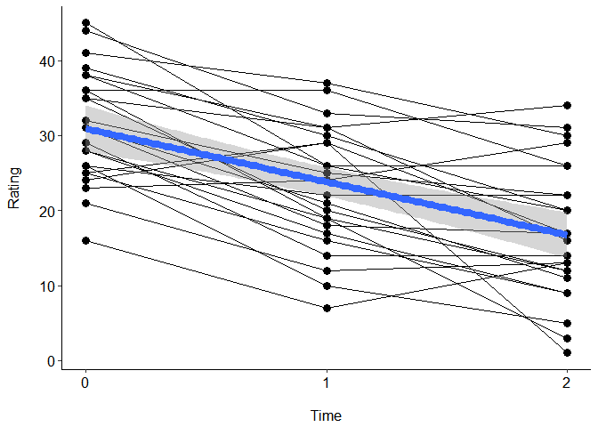
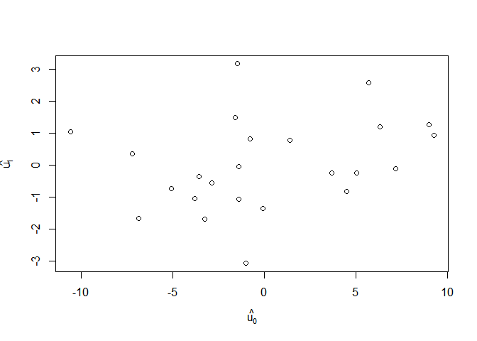
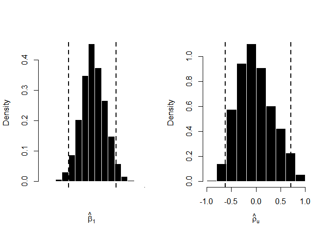

# Bayesian linear mixed models using RStan

## Yu-Han Luo


This is only the supplementary materials for my homework.  
It is provided as it is and I will **not** provide technical helps. 

  

## Before model fitting ...

- [Data](http://users.stat.ufl.edu/~winner/data/brain.dat)
   [Source](http://users.stat.ufl.edu/~winner/datasets.html)
  
- [Description](http://users.stat.ufl.edu/~winner/data/brain.txt)

```r
# load data
dat = read.table("data/brain.dat")
colnames(dat) = c("period", "id", "treatment", "rating")
dat$treatment = as.factor(dat$treatment)
# reset id
dat$id = 1:length(unique(dat$id))
# relative time
dat$time = as.integer(dat$period-1)
```

  


```r
# load packages (I'm lazy)
pacman::p_load(lme4, tidyverse, rstan, coda)
```

### Eyeballing data

```r
str(dat)
```

```
## 'data.frame':	72 obs. of  5 variables:
##  $ period   : int  1 1 1 1 1 1 1 1 1 1 ...
##  $ id       : int  1 2 3 4 5 6 7 8 9 10 ...
##  $ treatment: Factor w/ 3 levels "0","1","2": 1 1 1 1 1 1 1 1 1 1 ...
##  $ rating   : int  36 25 24 31 38 35 36 28 31 32 ...
##  $ time     : int  0 0 0 0 0 0 0 0 0 0 ...
```

```r
ggplot(dat, aes(x=time, y=rating))+
  geom_point(size=3)+
  geom_line(aes(group=id))+
  stat_smooth(method="lm", size=3)+
  scale_x_continuous(labels=c(0,1,2), breaks=seq(0,2))+
  labs(x="\nTime", y="Rating\n")+
  theme_classic()+
  theme(axis.title=element_text(color="black", size=12),
        axis.text=element_text(color="black", size=12))
```

<!-- -->
Though treatment was an important predictor of the data, it was ignored for simplification.
  
---

## Growth curve analysis

### Frequentist LMM

#### Fitting model using `lme4`


```r
rst = lmer(rating~time+(1+time|id), data=dat)  # by-subject random intercepts and slopes
summary(rst)
```

```
## Linear mixed model fit by REML ['lmerMod']
## Formula: rating ~ time + (1 + time | id)
##    Data: dat
## 
## REML criterion at convergence: 476.3
## 
## Scaled residuals: 
##     Min      1Q  Median      3Q     Max 
## -1.8468 -0.3712 -0.1189  0.4752  2.2729 
## 
## Random effects:
##  Groups   Name        Variance Std.Dev. Corr 
##  id       (Intercept) 39.872   6.314         
##           time         7.877   2.807    -0.16
##  Residual             20.667   4.546         
## Number of obs: 72, groups:  id, 24
## 
## Fixed effects:
##             Estimate Std. Error t value
## (Intercept)  30.9167     1.5424  20.045
## time         -7.0833     0.8711  -8.132
## 
## Correlation of Fixed Effects:
##      (Intr)
## time -0.408
```

  
### Bayesian LMM

#### preparation for connection with [Stan](http://mc-stan.org/)

```r
# prepare the data for Stan
stanDat = list(time = as.integer(dat$time),
               id = as.integer(dat$id),
               rating = dat$rating,
               N = nrow(dat),  # number of data points
               J = length(unique(dat$id)),# number of subjects
               K = length(unique(dat$time)))  # number of waves
# provide Stan the model parameters
ranSlpFit = stan(file="ranIntSlp.stan", data=stanDat, iter=2000, chains=4)
```

```
## In file included from C:/Program Files/R/R-3.4.3/library/BH/include/boost/config.hpp:39:0,
##                  from C:/Program Files/R/R-3.4.3/library/BH/include/boost/math/tools/config.hpp:13,
##                  from C:/Program Files/R/R-3.4.3/library/StanHeaders/include/stan/math/rev/core/var.hpp:7,
##                  from C:/Program Files/R/R-3.4.3/library/StanHeaders/include/stan/math/rev/core/gevv_vvv_vari.hpp:5,
##                  from C:/Program Files/R/R-3.4.3/library/StanHeaders/include/stan/math/rev/core.hpp:12,
##                  from C:/Program Files/R/R-3.4.3/library/StanHeaders/include/stan/math/rev/mat.hpp:4,
##                  from C:/Program Files/R/R-3.4.3/library/StanHeaders/include/stan/math.hpp:4,
##                  from C:/Program Files/R/R-3.4.3/library/StanHeaders/include/src/stan/model/model_header.hpp:4,
##                  from file2db07d133391.cpp:8:
## C:/Program Files/R/R-3.4.3/library/BH/include/boost/config/compiler/gcc.hpp:186:0: warning: "BOOST_NO_CXX11_RVALUE_REFERENCES" redefined
##  #  define BOOST_NO_CXX11_RVALUE_REFERENCES
##  ^
## <command-line>:0:0: note: this is the location of the previous definition
## cc1plus.exe: warning: unrecognized command line option "-Wno-macro-redefined"
## cc1plus.exe: warning: unrecognized command line option "-Wno-ignored-attributes"
## 
## SAMPLING FOR MODEL 'ranIntSlp' NOW (CHAIN 1).
## 
## Gradient evaluation took 0 seconds
## 1000 transitions using 10 leapfrog steps per transition would take 0 seconds.
## Adjust your expectations accordingly!
## 
## 
## Iteration:    1 / 2000 [  0%]  (Warmup)
## Iteration:  200 / 2000 [ 10%]  (Warmup)
## Iteration:  400 / 2000 [ 20%]  (Warmup)
## Iteration:  600 / 2000 [ 30%]  (Warmup)
## Iteration:  800 / 2000 [ 40%]  (Warmup)
## Iteration: 1000 / 2000 [ 50%]  (Warmup)
## Iteration: 1001 / 2000 [ 50%]  (Sampling)
## Iteration: 1200 / 2000 [ 60%]  (Sampling)
## Iteration: 1400 / 2000 [ 70%]  (Sampling)
## Iteration: 1600 / 2000 [ 80%]  (Sampling)
## Iteration: 1800 / 2000 [ 90%]  (Sampling)
## Iteration: 2000 / 2000 [100%]  (Sampling)
## 
##  Elapsed Time: 0.537 seconds (Warm-up)
##                0.513 seconds (Sampling)
##                1.05 seconds (Total)
## 
## 
## SAMPLING FOR MODEL 'ranIntSlp' NOW (CHAIN 2).
## 
## Gradient evaluation took 0 seconds
## 1000 transitions using 10 leapfrog steps per transition would take 0 seconds.
## Adjust your expectations accordingly!
## 
## 
## Iteration:    1 / 2000 [  0%]  (Warmup)
## Iteration:  200 / 2000 [ 10%]  (Warmup)
## Iteration:  400 / 2000 [ 20%]  (Warmup)
## Iteration:  600 / 2000 [ 30%]  (Warmup)
## Iteration:  800 / 2000 [ 40%]  (Warmup)
## Iteration: 1000 / 2000 [ 50%]  (Warmup)
## Iteration: 1001 / 2000 [ 50%]  (Sampling)
## Iteration: 1200 / 2000 [ 60%]  (Sampling)
## Iteration: 1400 / 2000 [ 70%]  (Sampling)
## Iteration: 1600 / 2000 [ 80%]  (Sampling)
## Iteration: 1800 / 2000 [ 90%]  (Sampling)
## Iteration: 2000 / 2000 [100%]  (Sampling)
## 
##  Elapsed Time: 0.534 seconds (Warm-up)
##                0.282 seconds (Sampling)
##                0.816 seconds (Total)
## 
## 
## SAMPLING FOR MODEL 'ranIntSlp' NOW (CHAIN 3).
## 
## Gradient evaluation took 0 seconds
## 1000 transitions using 10 leapfrog steps per transition would take 0 seconds.
## Adjust your expectations accordingly!
## 
## 
## Iteration:    1 / 2000 [  0%]  (Warmup)
## Iteration:  200 / 2000 [ 10%]  (Warmup)
## Iteration:  400 / 2000 [ 20%]  (Warmup)
## Iteration:  600 / 2000 [ 30%]  (Warmup)
## Iteration:  800 / 2000 [ 40%]  (Warmup)
## Iteration: 1000 / 2000 [ 50%]  (Warmup)
## Iteration: 1001 / 2000 [ 50%]  (Sampling)
## Iteration: 1200 / 2000 [ 60%]  (Sampling)
## Iteration: 1400 / 2000 [ 70%]  (Sampling)
## Iteration: 1600 / 2000 [ 80%]  (Sampling)
## Iteration: 1800 / 2000 [ 90%]  (Sampling)
## Iteration: 2000 / 2000 [100%]  (Sampling)
## 
##  Elapsed Time: 0.506 seconds (Warm-up)
##                0.411 seconds (Sampling)
##                0.917 seconds (Total)
## 
## 
## SAMPLING FOR MODEL 'ranIntSlp' NOW (CHAIN 4).
## 
## Gradient evaluation took 0 seconds
## 1000 transitions using 10 leapfrog steps per transition would take 0 seconds.
## Adjust your expectations accordingly!
## 
## 
## Iteration:    1 / 2000 [  0%]  (Warmup)
## Iteration:  200 / 2000 [ 10%]  (Warmup)
## Iteration:  400 / 2000 [ 20%]  (Warmup)
## Iteration:  600 / 2000 [ 30%]  (Warmup)
## Iteration:  800 / 2000 [ 40%]  (Warmup)
## Iteration: 1000 / 2000 [ 50%]  (Warmup)
## Iteration: 1001 / 2000 [ 50%]  (Sampling)
## Iteration: 1200 / 2000 [ 60%]  (Sampling)
## Iteration: 1400 / 2000 [ 70%]  (Sampling)
## Iteration: 1600 / 2000 [ 80%]  (Sampling)
## Iteration: 1800 / 2000 [ 90%]  (Sampling)
## Iteration: 2000 / 2000 [100%]  (Sampling)
## 
##  Elapsed Time: 0.572 seconds (Warm-up)
##                0.459 seconds (Sampling)
##                1.031 seconds (Total)
```

```
## Warning: There were 40 divergent transitions after warmup. Increasing adapt_delta above 0.8 may help. See
## http://mc-stan.org/misc/warnings.html#divergent-transitions-after-warmup
```

```
## Warning: Examine the pairs() plot to diagnose sampling problems
```

  

`ranIntSlp.stan` is modified from [the Rstan tutorial](https://github.com/vasishth/BayesLMMTutorial)

```
data {
  int<lower=1> N;                  //number of data points
  real rating[N];                  //rating
  real<lower=0,upper=2> time[N];   //predictor(time)
  int<lower=1> J;                  //number of subjects
  int<lower=1, upper=J> id[N];     //subject id
}

parameters {
  vector[2] beta;                  //intercept and slope
  real<lower=0> sigma_e;           //error sd
  vector<lower=0>[2] sigma_u;      //subj sd
  cholesky_factor_corr[2] L_u;
  matrix[2,J] z_u;
}

transformed parameters{
  matrix[2,J] u;
  u = diag_pre_multiply(sigma_u,L_u) * z_u;	//subj random effects
}

model {
  real mu;
  //priors
  L_u ~ lkj_corr_cholesky(2.0);
  to_vector(z_u) ~ normal(0,1);
  //likelihood
  for (i in 1:N){
    mu = beta[1] + u[1,id[i]] +(beta[2] + u[2,id[i]]) * time[i];
    rating[i] ~ normal(mu,sigma_e);
  }
}
```

#### Get credible intervals for parameters

```r
print(ranSlpFit, pars = c("beta", "sigma_e", "sigma_u"),
      probs = c(0.025, 0.5, 0.975))
```

```
## Inference for Stan model: ranIntSlp.
## 4 chains, each with iter=2000; warmup=1000; thin=1; 
## post-warmup draws per chain=1000, total post-warmup draws=4000.
## 
##             mean se_mean   sd  2.5%   50% 97.5% n_eff Rhat
## beta[1]    30.88    0.05 1.63 27.68 30.86 34.22  1285 1.00
## beta[2]    -7.13    0.02 0.92 -8.96 -7.14 -5.31  1400 1.00
## sigma_e     4.94    0.04 0.71  3.63  4.91  6.47   339 1.01
## sigma_u[1]  6.57    0.06 1.50  3.97  6.46  9.74   703 1.00
## sigma_u[2]  2.41    0.07 1.26  0.17  2.44  4.84   338 1.01
## 
## Samples were drawn using NUTS(diag_e) at Fri Mar 16 02:11:29 2018.
## For each parameter, n_eff is a crude measure of effective sample size,
## and Rhat is the potential scale reduction factor on split chains (at 
## convergence, Rhat=1).
```

```r
# check "significance"
beta1 <- extract(ranSlpFit, pars = c("beta[2]"))$beta
mean(beta1 < 0)
```

```
## [1] 1
```

  
  

#### TL;DR: examine the posterior density distribution


```r
# L matrices
L_u <- extract(ranSlpFit, pars = "L_u")$L_u
# correlation parameters
cor_u <- apply(L_u, 1, function(x) tcrossprod(x)[1, 2])
# 95CI for correlation between varying intercepts and slopes
print(signif(quantile(cor_u, probs = c(0.025, 0.5, 0.975)), 3))
```

```
##    2.5%     50%   97.5% 
## -0.6150 -0.0548  0.7250
```

```r
J<-length(unique(dat$id))
u<-matrix(nrow=2,ncol=J)
# ugly codes, but I'm lazy so...
for(j in 1:J)
  for(i in 1:2)
    u[i,j]<-mean(extract(ranSlpFit,pars=c(paste("u[",i,",",j,"]",sep="")))[[1]])

N_sample<-length(extract(ranSlpFit,pars="L_u[1,1]")[[1]])
L_u<-array(dim=c(2,2,N_sample))
for(i in 1:2)
  for(j in 1:2)
    L_u[i,j,]<-extract(ranSlpFit,pars=c(paste("L_u[",i,",",j,"]",sep="")))[[1]]

rho_u<-numeric()
for(i in 1:N_sample){
  rho_u<-L_u[,,i]%*%t(L_u[,,i])
  rho_u[i]<-rho_u[1,2]
}
# Visualize the posterior distribution for the intercept beta[1] ...
plot(u[1,],u[2,], bg="black", xlab=expression(hat(u[0])),ylab=expression(hat(u[1])))
```

<!-- -->

```r
# Get HPD interval for beta[2]
beta1<-as.mcmc(unlist(extract(ranSlpFit,pars="beta[2]")))
betaHPD<-HPDinterval(beta1,prob=0.95)
# Get HPD interval for rho_u
N_iter<-length(beta1)
rho_u<-numeric(N_iter)
L_u<-array(dim=c(2,2,N_iter))
for(i in 1:2)
  for(j in 1:2)
    L_u[i,j,]<-extract(ranSlpFit,pars=paste("L_u[",i,",",j,"]",sep=""))[[1]]
for(i in 1:N_iter)
  rho_u[i] <- tcrossprod(L_u[,,i])[1,2]
rho_u<-as.mcmc(rho_u)
rhoHPD<-HPDinterval(rho_u,prob=0.95)
# PLOT HPD INTERVALS ON THE MARGINAL POSTERIORS
par(mfrow=c(1,2))
hist(beta1,freq=FALSE,col="black",border="white",xaxt="n",
     main=NULL,xlab=expression(hat(beta)[1]))
abline(v=betaHPD,lty=2,lwd=2)
axis(1, at = seq(-.1,.1,length.out=5), labels = seq(-.1,.1,length.out=5))
hist(rho_u,freq=FALSE,col="black",border="white",
     main=NULL,xlab=expression(hat(rho)[u]),xlim=c(-1,1))
abline(v=rhoHPD,lty=2,lwd=2)
```

<!-- -->

### Sidenote

It was a refreshing change to learn Bayesian statistics. In my opinion, following the tutorial, the learning process went smoothly and I had no severe problems for the programming. Please give [it](http://www.ling.uni-potsdam.de/~vasishth/statistics/BayesLMMs.html) a try if interested.  
Cheers!  
Yu-Han
